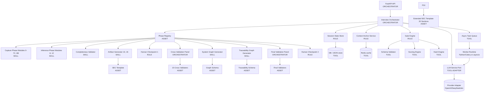
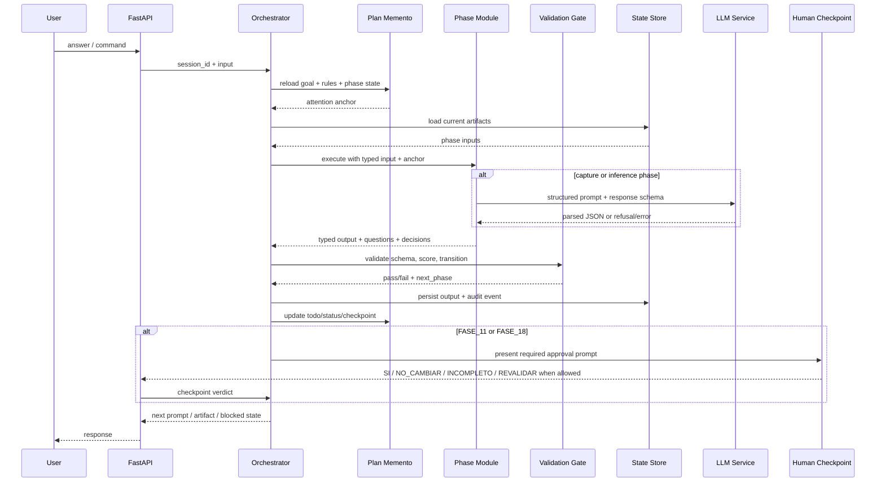
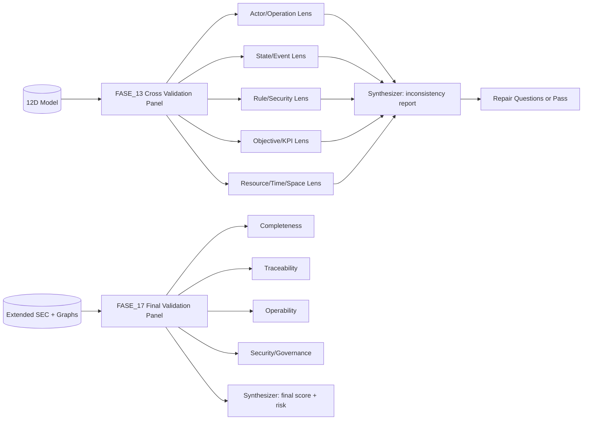
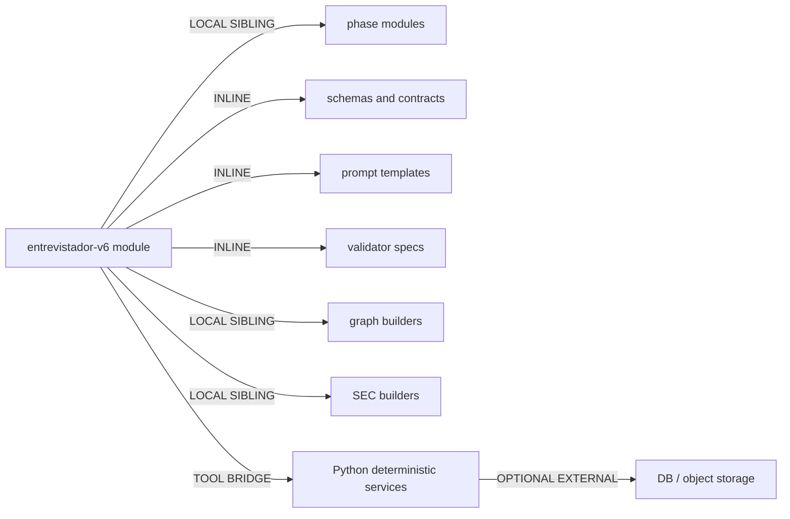

# Entrevistador V6 - Genesis Handoff Packet

Fecha: 2026-05-15
Fuente: `entrevistador_extensiones_v6.txt`
Target: Python/FastAPI, common-only design

## 1. Intento y Alcance

Entrevistador V6 convierte una peticion vaga en un contrato SEC extendido, un SYSTEM_GRAPH y un TRACEABILITY_GRAPH mediante un protocolo gobernado de 18 fases con dos checkpoints humanos obligatorios. El sistema no debe depender de que una conversacion larga "recuerde" reglas: cada fase recibe un contrato minimo, valida sus precondiciones, persiste sus salidas y reinyecta reglas criticas desde un plan/manifest antes de avanzar.

Fuera de alcance: UI final, proveedor LLM especifico, persistencia fisica definitiva, autenticacion del producto, despliegue y generacion automatica de codigo de negocio a partir del SEC.

Dispatch description propuesta:

Use este modulo cuando el usuario quiera disenar, ejecutar o refactorizar Entrevistador V6: un protocolo de entrevista estructurada que transforma requisitos vagos en SEC, SYSTEM_GRAPH y TRACEABILITY_GRAPH con fases modulares, contratos explicitos, validaciones, checkpoints humanos y proteccion contra fuga de contexto en sesiones largas. No usar para entrevistas libres, chat casual ni generacion directa de aplicaciones sin SEC.

## 2. Patrones Seleccionados

- R1 SPLIT: el monolito mezcla extraccion, inferencia, validacion, generacion de documentos, grafos, scoring y supervision. Se divide por unidad de cambio y por contrato de datos.
- A2 PIPELINE: las 18 fases tienen orden, precondiciones y handoffs verificables.
- A1 PANEL: se usa dentro de FASE_13 y FASE_17 para validacion multi-lente, no como topologia global.
- B4 PLAN MEMENTO: el plan, reglas maestras, estado de fases, artefactos y decisiones se persisten antes de ejecucion y se recargan al inicio de cada fase.
- B8 ATTENTION ANCHOR: cada fase recibe un anchor corto: objetivo global, reglas irrompibles, umbrales, fase actual y criterios de avance.
- S4 VALIDATION DECORATOR: cada fase valida input/output contra schema antes de persistir y antes de pasar a la siguiente.
- B10 HUMAN CHECKPOINT: obligatorio en FASE_11 y FASE_18.
- S7 DETERMINISTIC TOOL BRIDGE: hashes, scores, validacion de schemas y grafos se calculan con codigo deterministico, no con prosa LLM.
- S2 DEPENDENCY ADAPTER: el proveedor LLM queda detras de un puerto `LLMService`; las fases no llaman directamente a OpenAI, DeepSeek, Anthropic ni a ningun SDK concreto.

## 3. Component Diagram



## 4. Runtime Sequence Diagram



## 5. A1 Panel Placement



Anti-pattern avoided: PANEL-IN-ONE-CONTEXT. Each validator lens must run from persisted artifacts and return structured findings. The synthesizer decides; validators do not mutate shared state.

## 6. Dependency Graph



External modules required: none at design time. Runtime libraries may later be chosen during implementation, but this packet does not declare a cross-project agentic module dependency.

## 7. Proposed Python/FastAPI Modules

### `app/api/routes/interview.py`

Trigger: HTTP surface for starting sessions, submitting answers, reading state, approving checkpoints.

Inputs: `session_id`, user answer, optional command.

Outputs: next prompt, phase status, artifacts summary, checkpoint prompt.

Dependencies: `InterviewOrchestrator`.

### `app/core/orchestrator.py`

Trigger: every turn of an interview session.

Inputs: session state, current user input.

Outputs: `TurnResult` with next phase, prompt, persisted artifact refs, blocking condition.

Dependencies: phase registry, state store, gate engine, context anchor service.

### `app/core/phase_registry.py`

Trigger: orchestrator needs the current or next phase.

Inputs: phase id.

Outputs: `PhaseDefinition` with input schema, output schema, executor, gate config and next transition rules.

Dependencies: phase modules.

### `app/core/context_anchor.py`

Trigger: before phase execution, before panel spawn, after validation failure, after checkpoint return.

Inputs: session plan, phase id, global rules.

Outputs: compact anchor containing goal, no-go rules, thresholds, current phase contract and acceptance criteria.

Dependencies: plan memento store.

### `app/core/gates.py`

Trigger: after every phase output.

Inputs: phase id, typed output, session artifacts.

Outputs: pass/fail, score, errors, next phase, retry target.

Dependencies: schema validators, scoring engine, graph integrity checks.

### `app/core/llm_service.py`

Trigger: capture and inference phases need interpretation, normalization or a constrained follow-up question.

Inputs: `PromptEnvelope`, `response_model`, retry policy, provider config.

Outputs: validated Pydantic object, refusal, timeout or malformed-output error.

Dependencies: provider adapters only. No phase imports provider SDKs directly.

Provider policy: model IDs are configuration, not constants in phase code. Keep per-phase defaults in runtime config and verify exact provider IDs before release because model catalogs change.

### `app/core/scoring.py`

Trigger: FASE_9 and FASE_17 scoring, plus any gate that needs deterministic point totals.

Inputs: persisted artifacts and validator specs.

Outputs: `ScoreReport` with total, per-rule points, failed checks, repair targets and status.

Dependencies: pure validator functions. It must not call the LLM.

### `app/core/defaults_repository.py`

Trigger: user answers `DESCONOCIDO` or gives an allowed range that needs a documented default.

Inputs: system type, dimension, field, confidence source.

Outputs: default value, unit, rationale and estimation flag.

Dependencies: extracted pattern/default library from `entrevistador_extensiones_v6.txt`.

Required contents: the five system types from Section 4 of `entrevistador_extensiones_v6.txt` with exact values for concurrency, normal response time, retention, timeout and recommended modules with priority and historical rationale:

- `DASHBOARD_INTERNO`
- `API_PUBLICA`
- `TIEMPO_REAL_IOT`
- `BATCH_ETL`
- `WEB_B2C` as default

### `app/storage/session_store.py`

Trigger: any state read/write.

Inputs: session id, artifact type, phase id.

Outputs: durable session snapshot and audit event.

Dependencies: DB/file implementation.

Recommended implementation: PostgreSQL 16 with JSONB artifact columns. Orchestrator writes must be transactional so phase output, gate result, audit event and Plan Memento update commit atomically.

### `app/storage/anchor_cache.py`

Trigger: every phase reloads the compact B8 context anchor.

Inputs: session id, phase id, global rules version.

Outputs: cached context anchor with TTL and source snapshot hash.

Dependencies: Redis 7 and session store fallback. Redis is an acceleration layer; PostgreSQL remains source of truth.

### `app/workers/tasks.py`

Trigger: long-running LLM narrative jobs and validation-panel fan-out.

Inputs: session id, phase id, persisted artifact refs, validator lens.

Outputs: structured panel findings, inference drafts or completion events persisted through the state store.

Dependencies: same Python image as API, `LLMService`, validators, session store. Use Celery with Redis broker for production, or asyncio background tasks for early local development.

### `app/models/contracts.py`

Trigger: imported by API, orchestrator, phases, gates.

Inputs: none at runtime beyond Pydantic validation.

Outputs: typed schemas for 12 dimensions, SEC, graphs, phase I/O, scores, approvals, estimations, decision records, SEC state, graph nodes/edges and traceability matrices.

Required contract families:

```python
class EstimationEntry(BaseModel):
    id: str  # EST_{SEC_ID}_{campo}_{timestamp_unix}
    campo: str
    tipo: Literal["CONFIRMADO", "RANGO_ESTIMADO", "DESCONOCIDO", "POR_DEFECTO"]
    valor_usado: Any
    rango: dict[Literal["min", "max"], Any] | None
    confianza: float = Field(ge=0.0, le=1.0)
    fuente: Literal["humano_exacto", "humano_estimado", "humano_desconocido", "estandar_proyectos"]
    mitigation: str
    requiere_revision: bool
    revision_deadline: datetime | None
    estado: Literal["ACTIVA", "REFINADA", "DESCARTADA", "OBSOLETA"]

class EstimationsSection(BaseModel):
    entries: list[EstimationEntry]

CONSTRAINTS_HASH_FORMULA = "sha256(CONSTRAINTS_SECTION + ESTIMATIONS_SECTION)"

class DecisionRecord(BaseModel):
    id: str  # DEC-{NNN}
    timestamp: datetime
    agent: Literal["ENTREVISTADOR"]
    decision: str
    rationale: str  # reference dimension or rule
    overrides: list[str]
    status: Literal["LOCKED"]

class SECState(BaseModel):
    global_state: Literal["UNKNOWN"]
    per_scope_states: dict[str, Literal["UNKNOWN"]]

class NodeType(str, Enum):
    ACTOR = "ACTOR"
    OBJETO = "OBJETO"
    OPERACION = "OPERACION"
    EVENTO = "EVENTO"
    ESTADO = "ESTADO"
    REGLA = "REGLA"
    RECURSO = "RECURSO"
    OBJETIVO = "OBJETIVO"
    ESPACIO = "ESPACIO"
    CANAL = "CANAL"

class EdgeType(str, Enum):
    ejecuta = "ejecuta"
    modifica = "modifica"
    dispara = "dispara"
    restringe = "restringe"
    consume = "consume"
    comunica = "comunica"
    depende = "depende"
    optimiza = "optimiza"
    replica = "replica"
    monitorea = "monitorea"

class GraphNode(BaseModel):
    id: str
    tipo: NodeType
    criticidad: Literal["CRITICA", "ALTA", "MEDIA", "BAJA"]
    metadata: dict[str, Any]

class GraphEdge(BaseModel):
    source: str
    target: str
    tipo: EdgeType
    criticidad: Literal["CRITICA", "ALTA", "MEDIA", "BAJA"]
    consistencia: Literal["FUERTE", "EVENTUAL"]

class SystemGraph(BaseModel):
    nodes: list[GraphNode]
    edges: list[GraphEdge]

ORPHAN_CHECK_RULE = "toda operacion debe conectar a actor+objeto+estado+regla+recurso+objetivo"

class TraceabilityType(str, Enum):
    funcional = "funcional"
    temporal = "temporal"
    operacional = "operacional"
    seguridad = "seguridad"
    infraestructura = "infraestructura"
    negocio = "negocio"

class TraceabilityNode(BaseModel):
    id: str
    nivel: Literal["objetivo", "scope", "operacion", "estado", "regla", "recurso"]
    tipo: TraceabilityType
    refs: list[str]

class TraceabilityMatrixRow(BaseModel):
    objetivo: str
    scope: str
    operacion: str
    recurso: str
    kpi: str

class TraceabilityMatrix(BaseModel):
    rows: list[TraceabilityMatrixRow]

class TraceabilityGraph(BaseModel):
    hierarchy: list[TraceabilityNode]
    matrix: TraceabilityMatrix
    traceability_type: TraceabilityType
```

Rule: documented estimations do not penalize scoring. Only undocumented ambiguity penalizes R9/R12.

Traceability hierarchy order is fixed: objetivo -> scope -> operacion -> estado -> regla -> recurso.

Dependencies: none.

### `app/phases/capture.py`

Trigger: FASE_0 through FASE_7C and FASE_8B.

Inputs: current typed model, user answer, anchor.

Outputs: structured dimension deltas and next structured prompt.

Dependencies: prompt templates, `LLMService`, defaults repository, validators.

### `app/phases/generation.py`

Trigger: FASE_10 and FASE_16.

Inputs: validated artifacts, scores, graph outputs.

Outputs: SEC initial or SEC extended.

Dependencies: SEC templates, hash engine. Must not call the LLM.

### `app/phases/inference.py`

Trigger: FASE_8 and FASE_12.

Inputs: 12D model, approved modules, exclusions.

Outputs: proposed modules, required explicit questions, approved/rejected module decisions.

Dependencies: pattern library extracted from document, `LLMService` for explanation/question drafting only, deterministic allow/deny rules for final decisions.

FASE_8 must load a static data file, not ask the LLM to invent the module set:

```python
FASE_8_RULES: list[InferenceRule]
```

It contains the exact 12 inference rules from `entrevistador_extensiones_v6.txt`: authentication, database, audit, health checks, pre-flight checks, circuit breaker, excess queue, RBAC, atomic transactions, scheduler jobs, automatic backup and rate limiting. LLM output may draft explanations/questions, but rule selection and approval state are deterministic and require explicit human approval.

### `app/phases/validation_panel.py`

Trigger: FASE_9, FASE_13 and FASE_17.

Inputs: persisted artifacts.

Outputs: scores, inconsistencies, repair targets, risk state.

Dependencies: validator specs, deterministic scoring engine. The panel may use LLM lenses for narrative findings only; scores come from `app/core/scoring.py`.

### `app/phases/graphs.py`

Trigger: FASE_14 and FASE_15.

Inputs: complete 12D model, SEC, validations.

Outputs: `SystemGraph`, `TraceabilityGraph`.

Dependencies: graph schema, graph connectivity validator.

### `app/phases/checkpoints.py`

Trigger: FASE_11 and FASE_18.

Inputs: SEC or full system package, score, risk, required message template.

Outputs: checkpoint state: approved, change requested, incomplete target, revalidate target for FASE_18 only, blocked.

Dependencies: state store.

Checkpoint verdicts are phase-specific:

```python
class CheckpointVerdict(str, Enum):
    APPROVED = "SI"
    CHANGE_REQUESTED = "NO_CAMBIAR"
    INCOMPLETE = "INCOMPLETO"
    REVALIDATE = "REVALIDAR"

class CheckpointConfig(BaseModel):
    allowed_verdicts: list[CheckpointVerdict]
```

- FASE_11 allows `SI`, `NO_CAMBIAR` and `INCOMPLETO`.
- FASE_18 allows `SI`, `NO_CAMBIAR`, `INCOMPLETO` and `REVALIDAR`.

Checkpoint assets must include the literal V5 `CHECKPOINT_1_TEMPLATE` for FASE_11 and the literal V6 `CHECKPOINT_2_TEMPLATE` for FASE_18.

`CHECKPOINT_1_TEMPLATE`:

```text
=== CONTRATO SEC GENERADO ===
Puntuacion de calidad: {XX}%
Umbral requerido: 85% (ideal) / 70% (minimo)
Estado: {APROBADO | APROBADO_CON_RESERVAS | RECHAZADO}
[SEC_DOCUMENT]
Este contrato representa lo que discutimos?
RESPONDE CON UNA DE ESTAS OPCIONES:

'SI'                            -> El SEC esta listo.
'NO, CAMBIAR: [especificacion]' -> Modifico el SEC.
'INCOMPLETO: [dimension]'       -> Regreso a FASE.
```

`CHECKPOINT_2_TEMPLATE` must preserve the exact V6 FASE_18 wording and must expose exactly these response options: `SI`, `NO_CAMBIAR: [detalle]`, `INCOMPLETO: [fase]`, `REVALIDAR: [elemento]`.

### `app/validators/`

Trigger: scoring, gate checks and panel validation need deterministic findings.

Inputs: typed persisted artifacts only.

Outputs: `RuleResult`, cross-validator findings and final validator findings with evidence paths.

Files:

- `app/validators/fase9_rules.py`: R1-R15, one pure function per rule.
- `app/validators/fase17_rules.py`: VF_1-VF_15.
- `app/validators/cross_validators.py`: VALIDADOR_1 through VALIDADOR_15.

Dependencies: contracts only. No LLM calls.

## 8. Phase Contracts

Each phase implements this base interface:

```python
class Phase(Protocol):
    id: PhaseId
    title: str
    kind: PhaseKind
    input_model: type[BaseModel]
    output_model: type[BaseModel]
    requires_human_confirmation: bool

    def build_prompt(self, ctx: PhaseContext) -> PromptEnvelope: ...
    def validate(self, ctx: PhaseContext, output: PhaseOutput) -> GateResult: ...
```

Phase kinds:

- `CAPTURE`: asks the human for structured information. May call `LLMService` to normalize an answer into a schema.
- `INFERENCE`: proposes missing infrastructure or follow-up questions. May call `LLMService`, but final accept/reject state requires explicit human answer or deterministic rule.
- `VALIDATION`: computes findings and scores from artifacts. Must not call `LLMService` for scoring.
- `GENERATION`: renders SEC documents from artifacts and templates. Must not call `LLMService`.
- `GRAPH`: builds graph artifacts from typed model data. Must not call `LLMService`.
- `CHECKPOINT`: blocks progression until explicit human approval.

Specialized interfaces:

```python
class CapturePhase(Phase, Protocol):
    kind: Literal[PhaseKind.CAPTURE]
    def parse_answer(self, ctx: PhaseContext, answer: UserAnswer, llm: LLMService) -> PhaseOutput: ...

class InferencePhase(Phase, Protocol):
    kind: Literal[PhaseKind.INFERENCE]
    def infer(self, ctx: PhaseContext, llm: LLMService) -> PhaseOutput: ...

class DeterministicPhase(Phase, Protocol):
    kind: Literal[PhaseKind.VALIDATION, PhaseKind.GENERATION, PhaseKind.GRAPH, PhaseKind.CHECKPOINT]
    def execute(self, ctx: PhaseContext) -> PhaseOutput: ...
```

LLM boundary rule: no deterministic phase receives an `LLMService` argument. This makes accidental provider calls visible at type/review time.

Minimum `PhaseOutput` fields:

- `phase_id`
- `artifact_updates`
- `questions_asked`
- `assumptions`
- `estimations`
- `explicit_approvals`
- `validation_findings`
- `next_phase_hint`

Minimum `GateResult` fields:

- `status`: `PASS | FAIL | NEEDS_REPAIR | NEEDS_HUMAN`
- `score`
- `errors`
- `repair_phase`
- `max_retries_remaining`
- `blocking_rules`

## 9. Phase Map

| Phase | Kind | Module | LLM | Input | Output | Gate |
|---|---|---|---|---|---|---|
| FASE_0 | CAPTURE | capture | yes | empty/session goal | actor seed + opening prompt | confirms start |
| FASE_1 | CAPTURE | capture | yes | actor seed | objects table | min 3, max 10, units/ranges |
| FASE_2 | CAPTURE | capture | yes | objects | operations table | owner object, actor, result |
| FASE_3 | CAPTURE | capture | yes | objects + operations | state transitions | min 3 states, events required |
| FASE_3B | CAPTURE | capture | yes | objects + actors | relations table | cardinality and propagation present |
| FASE_4 | CAPTURE | capture | yes | model so far | no-go rules | 5 domain-specific rules |
| FASE_5 | CAPTURE | capture | yes | rules + operations | external events | every event has action |
| FASE_6 | CAPTURE | capture | yes | operations/events | time model | units, defaults documented |
| FASE_7 | CAPTURE | capture | yes | operations/time | resource model | limits and degradation present |
| FASE_7B | CAPTURE | capture | yes | resources | space model | location/region/latency present |
| FASE_7C | CAPTURE | capture | yes | components | communication model | protocol/sync/retry/order present |
| FASE_8 | INFERENCE | inference | yes | 12D partial model (dims 1-11, objectives pending) | explicit module questions | no implicit module approval |
| FASE_8B | CAPTURE | capture | yes | full model | objective model | KPI, priority, tradeoff present |
| FASE_9 | VALIDATION | validation_panel | no | extracted model | V5 completeness `ScoreReport` | >=85 pass; 70-84 repair loop max 3 then FAIL_HARD to FASE_1; <70 return FASE_1 |
| FASE_10 | GENERATION | generation | no | V5 score + model | initial SEC | template complete + hash |
| FASE_11 | CHECKPOINT | checkpoints | no | initial SEC | human approval 1 | explicit SI required |
| FASE_12 | INFERENCE | inference | yes | approved SEC | V6 infra module proposals | no duplicate FASE_8 modules |
| FASE_13 | VALIDATION | validation_panel | optional narrative only | 12D + modules | cross-validation report | 15 validators pass or repair |
| FASE_14 | GRAPH | graphs | no | 12D + report | SYSTEM_GRAPH | no orphan nodes |
| FASE_15 | GRAPH | graphs | no | SEC + system graph | TRACEABILITY_GRAPH | every element has why/who/protects/objective/impact |
| FASE_16 | GENERATION | generation | no | all artifacts | extended SEC 20 sections | all sections present |
| FASE_17 | VALIDATION | validation_panel | optional narrative only | full package | final `ScoreReport` + risk | always continue to FASE_18; failed areas become checkpoint risk evidence |
| FASE_18 | CHECKPOINT | checkpoints | no | full package | final human approval | explicit SI or valid REVALIDAR/NO_CAMBIAR/INCOMPLETO required |

Correction from prior packet: `extraction.py` is renamed to `capture.py`, and `sec.py` is renamed to `generation.py`. FASE_8 and FASE_12 are not capture phases; they are inference phases because they propose system modules from existing artifacts. FASE_10 and FASE_16 are not extraction phases; they are deterministic artifact generation phases.

## 9.1 LLM Integration Contract

LLM integration is a port, not a provider dependency:

```python
class LLMService(Protocol):
    def generate_structured(
        self,
        prompt: PromptEnvelope,
        response_model: type[T],
        policy: LLMPolicy,
    ) -> LLMResult[T]: ...
```

Provider adapters implement this port:

- `OpenAIAdapter`
- `DeepSeekAdapter`
- `FakeLLMAdapter` for tests and evals

`PromptEnvelope` must include:

- `system_anchor`: compact B8 anchor from persisted plan.
- `phase_contract`: current phase objective, allowed fields and prohibited behavior.
- `user_input`: raw answer.
- `artifacts_summary`: only the upstream fields this phase needs.
- `response_schema_name`: expected Pydantic model.

`LLMPolicy` must include:

- `temperature`: default `0.1`.
- `timeout_seconds`: default `30`.
- `max_malformed_retries`: default `2`.
- `allow_free_text`: default `false`.
- `refusal_behavior`: `ASK_REPAIR | BLOCK | FALLBACK_DEFAULT`.

Hard boundary:

- LLM may normalize human answers into typed deltas.
- LLM may draft the next structured question.
- LLM may suggest candidate infrastructure modules in FASE_8 and FASE_12.
- LLM must not calculate scores, hashes, graph connectivity, approval state, phase transitions or final risk.
- LLM must not mark modules as approved unless the artifact contains explicit human approval.

## 9.2 Deterministic Scoring Contract

All scoring returns this structure:

```python
class RuleResult(BaseModel):
    rule_id: str
    label: str
    max_points: int
    points: int
    passed: bool
    failures: list[str]
    repair_phase: PhaseId | None
    evidence_paths: list[str]

class ScoreReport(BaseModel):
    score_id: str
    phase_id: PhaseId
    total_points: int
    max_points: int = 100
    percent: int
    status: str
    risk: str | None = None
    rules: list[RuleResult]
    repair_targets: list[PhaseId]
```

FASE_9 scoring table:

| Rule | Points | Repair target |
|---|---:|---|
| R1 Actores | 4 | FASE_0 |
| R2 Objetos | 6 | FASE_1 |
| R3 Operaciones | 5 | FASE_2 |
| R4 Estados | 5 | FASE_3 |
| R5 Reglas | 5 | FASE_4 |
| R6 Eventos | 5 | FASE_5 |
| R7 Tiempo | 5 | FASE_6 |
| R8 Recursos | 5 | FASE_7 |
| R9 Ausencia de ambiguedad lexica | 10 | lowest offending phase |
| R10 Consistencia interna | 10 | offending dependency phase |
| R11 Cobertura de inferencia | 10 | FASE_8 |
| R12 Cuantificacion completa | 10 | offending capture phase |
| R13 Plan de riesgos | 10 | FASE_4 or FASE_8 |
| R14 Verificabilidad de metricas | 10 | FASE_8B if KPI absent; FASE_10 if acceptance rule format invalid |
| R15 Estrategia de exceso | 10 | FASE_7 or FASE_6 |

FASE_9 status:

- `>=85`: `APROBADO`
- `70-84`: `APROBADO_CON_RESERVAS`
- `<70`: `RECHAZADO`

FASE_9 gate:

- `>=85`: `PASS` and continue to FASE_10.
- `70-84`: `NEEDS_REPAIR` while `repair_attempts[FASE_9] < 3`; repair target is the lowest-scoring offending phase; persist the attempt counter in the session state before routing to repair; after 3 attempts return `FAIL_HARD` to FASE_1.
- `<70`: `FAIL`; return to FASE_1.

FASE_17 scoring table:

| Area | Points | Validator examples |
|---|---:|---|
| COMPLETITUD | 10 | all required artifacts and SEC sections present |
| CONSISTENCIA | 10 | operation/actor/state/event consistency |
| TRAZABILIDAD | 10 | every graph element has trace path |
| OPERABILIDAD | 10 | timeouts, fallbacks, resource degradation |
| OBSERVABILIDAD | 10 | critical events produce logs/metrics/traces/audit |
| ESCALABILIDAD | 10 | load, resources, queues, rate limits documented |
| RESILIENCIA | 10 | retries, failover, external dependency failure strategy |
| SEGURIDAD | 10 | rules have enforcement, auth/RBAC if needed |
| GOBERNANZA | 10 | decisions, exclusions, rationale, approvals |
| VERIFICABILIDAD | 10 | binary acceptance rules and deterministic evidence |

FASE_17 status:

- `>=90`: `APROBADO_ENTERPRISE`, risk `LOW`
- `80-89`: `APROBADO_PRODUCCION`, risk `LOW|MEDIUM` from failed areas
- `70-79`: `APROBADO_CON_RESERVAS`, risk `MEDIUM`
- `<70`: `RECHAZADO`, risk `HIGH`

FASE_17 gate:

- Always routes to FASE_18.
- Failed areas, repair targets and risk are passed as checkpoint evidence.
- FASE_18 is the blocking human decision point; it may approve, request changes, mark incomplete or ask to revalidate an element.

Scoring implementation rules:

- Each rule is a pure function in `app/validators/`.
- Each rule receives typed artifacts only.
- Each rule emits evidence paths, not prose-only claims.
- The scoring engine sums points and chooses repair targets.
- Logs must include per-rule points and failures.
- Tests must cover every rule with pass, partial and fail fixtures.

## 10. State Model

Persist one `InterviewSession` per run:

```yaml
session_id: string
current_phase: PhaseId
global_anchor:
  goal: "Convert vague request into SEC + graphs"
  hard_rules:
    # V5 NO PUEDE
    - no colloquial questions
    - no open questions without structure
    - no advance without explicit human confirmation where required
    - no SEC under 70
    - no percentages in acceptance rules
    - no numbers without units
    - no orphan graph nodes
    # V5 REGLAS FUNDAMENTALES
    - NO_SE -> use pattern default from defaults_repository; INCIERTO -> use maximum safe value; APROXIMADO -> use provided value; always document in ESTIMATIONS
    - show full dimension table before asking for answers (MAPA VISIBLE)
    - no implicit module approval; every module requires explicit ACEPTADO/FUTURO/EXCLUSION
    - every number must have unit; every operation must have actor; every state must have transition
    # V6 REGLAS MAESTRAS
    - every entity must trace to objective + operation + rule + actor
    - every operation must have actor + state change + rules + resources + space + time
    - every state transition must have trigger + origin + destination + validation + rollback
    - every communication must have protocol + timeout + failure strategy + security
    - every objective must be observable + verifiable and must affect operations/resources/decisions
    - every limited resource must have max + degradation + fallback + monitoring
    - every event must have origin + action + priority + error behavior
    - every relation must have cardinality + ownership + consistency + propagation
artifacts:
  dimensions_12d: object
  sec_initial: object
  system_graph: object
  traceability_graph: object
  sec_extended: object
scores:
  v5_completeness: ScoreReport
  v6_final: ScoreReport
llm:
  provider: string
  calls:
    - timestamp
      phase_id
      prompt_hash
      response_hash
      response_model
      status
checkpoints:
  phase_11: pending|approved|change_requested|incomplete
  phase_18: pending|approved|change_requested|incomplete|revalidate
repair_attempts:
  FASE_9: 0
audit_log:
  - timestamp
    phase_id
    input_hash
    output_hash
    gate_result
```

## 11. Context-Leakage Controls

1. Phase execution receives only:
   - current phase contract
   - compact context anchor
   - required upstream artifacts by reference or summary
   - current answer
2. Long source text is not loaded at runtime. It is compiled into:
   - prompt templates
   - schema definitions
   - validator specs
   - phase transition table
3. Every phase starts by reloading `InterviewSession.global_anchor`.
4. Every panel worker receives only its lens, artifacts and validator contract.
5. Every phase output is persisted before the next prompt is built.
6. Every deterministic fact is computed by code: hash, score, graph connectivity, schema validity.
7. LLM calls are logged by prompt/response hash so a later audit can reproduce which model output produced which artifact delta.
8. Generation phases consume persisted artifacts only; they do not reload or summarize the original monolith.

## 12. Module Composition Table

| Box | Mode | Rationale |
|---|---|---|
| FastAPI API | LOCAL SIBLING | Product runtime surface; independent from phase logic |
| Interview Orchestrator | LOCAL SIBLING | Central workflow coordinator |
| Phase Registry | INLINE | Static table unique to Entrevistador V6 |
| Session State Store | LOCAL SIBLING | Runtime persistence can change independently |
| PostgreSQL 16 | TOOL | ACID source of truth for sessions, artifacts, gates and audit log |
| Redis 7 | TOOL | Cache for B8 anchors and optional Celery broker |
| Worker Runtime | LOCAL SIBLING | Executes long-running inference/panel work and async deterministic jobs |
| Frontend Runtime | LOCAL SIBLING | Bun + React + Vite operational console for phases, graphs, SEC and checkpoints |
| Context Anchor Service | LOCAL SIBLING | Shared by all phases and panels |
| LLM Service Port | LOCAL SIBLING | Provider boundary; prevents SDK coupling inside phases |
| Provider Adapters | LOCAL SIBLING | Replaceable runtime integration for OpenAI/DeepSeek/etc. |
| Gate Engine | LOCAL SIBLING | Shared validation boundary |
| Capture Phase Modules 0-7C, 8B | LOCAL SIBLING | Human-answer capture phases share schema family |
| Inference Phase Modules 8, 12 | LOCAL SIBLING | Module proposal logic changes independently from capture |
| Completeness Validator | LOCAL SIBLING | Scoring changes independently from prompts |
| Scoring Engine | LOCAL SIBLING | Deterministic point accounting for FASE_9 and FASE_17 |
| SEC Generators | LOCAL SIBLING | Deterministic template/document generation concern |
| Human Checkpoints | LOCAL SIBLING | Human gate rules must stay explicit |
| Cross/Final Validation Panels | LOCAL SIBLING | Multi-lens validation should not pollute extraction context |
| Graph Generators | LOCAL SIBLING | Graph schemas and algorithms evolve separately |
| Deterministic Validators (`app/validators/`) | INLINE | Unique V6 validator functions for FASE_9, FASE_13 and FASE_17 |
| Prompt Templates | INLINE assets | Unique to this system, lazy loaded by phase |
| Validator Specs | INLINE assets | Unique unless reused by 3+ projects |
| Python deterministic services | TOOL BRIDGE | Must compute facts, not assert them |

## 13. Compliance Findings

- HIGH: `entrevistador_extensiones_v6.txt` is a monolith with R1 SPLIT triggers: body over budget, multi-lens body, divergent change cadence and fragment callers.
- HIGH: Current document embeds runtime prompts, validation rules and output templates together; this risks context leakage and rule loss.
- HIGH: LLM boundary must be explicit. Without `LLMService`, provider SDK calls will leak into phase modules and make tests/non-LLM execution brittle.
- HIGH: Scoring must be a deterministic subsystem with rule evidence. A prose validator cannot enforce V5/V6 thresholds reliably.
- HIGH: Capture and generation must be separate phase kinds. Mixing them lets generation inherit interview context and reintroduces monolith behavior.
- MEDIUM: FASE_10 references graph sections generated later in FASE_14/15. Implementation should allow placeholder refs in initial SEC or defer graph inclusion to FASE_16.
- MEDIUM: FASE_0 says 8 dimensions while V6 has 12 dimensions. Keep as original prompt if V5 compatibility is mandatory, but anchor should clarify V6 extraction includes four later additive dimensions.
- LOW: Encoding in source text appears mojibake in terminal output; normalize before turning it into templates.

## 13.1 Recommended Runtime Stack

Backend:

- Python `3.12-slim`.
- FastAPI + Uvicorn.
- Pydantic v2 for all phase and artifact contracts.
- SQLAlchemy async + `asyncpg`.
- PostgreSQL 16 as the source of truth.
- PostgreSQL JSONB for phase artifacts, SEC sections, graph payloads and audit snapshots.
- Redis 7 for B8 context-anchor cache and Celery broker.
- `redis-py` for cache access.
- `httpx` behind `LLMService` provider adapters.
- `pytest` for validators, gates, eval fixtures and context-leakage regressions.
- `networkx` may be used inside graph validators/builders, but graph facts still persist as typed Pydantic artifacts.

Backend rule: no Bun in the Python backend. Validators, scoring, hashing, graph checks and SEC generation are pure Python deterministic services.

Frontend:

- Bun + React + Vite for development and build.
- Zustand or local React state for phase-answer drafting.
- TanStack Query for API state and async phase polling.
- WebSocket or Server-Sent Events for worker phase completion notifications.
- TanStack Table for dimension, score and validator tables.
- React Flow or Cytoscape.js for SYSTEM_GRAPH and TRACEABILITY_GRAPH visualization.
- Custom 18-phase stepper.
- Blocking checkpoint modal for FASE_11 and FASE_18.
- HTML-print or React-PDF export for readable SEC delivery.

Containers:

```text
docker-compose
+-- api       -> Python/FastAPI, port 8000
+-- worker    -> same Python image as api, Celery worker or async task runner
+-- db        -> PostgreSQL 16
+-- cache     -> Redis 7
+-- frontend  -> Bun + Vite in dev; nginx serving static build in prod
```

LLM routing:

| Phase | Type | Default route | Channel |
|---|---|---|---|
| FASE_0-7 | Interactive capture | fast/cheap Claude-class small model, configurable | async direct |
| FASE_8 | Initial inference | stronger Claude-class model, configurable | async direct |
| FASE_9 | Deterministic scoring | no LLM | Python only |
| FASE_10 | Initial SEC generation | no LLM | Python templates + hash |
| FASE_11 | Human checkpoint | no LLM | blocking human gate |
| FASE_12 | Systemic inference | DeepSeek reasoning-class model or equivalent, configurable | worker |
| FASE_13 | 15-validator panel narrative findings | DeepSeek reasoning-class model or equivalent, configurable | worker |
| FASE_14-15 | Graph generation | no LLM | Python graph builders + validators |
| FASE_16 | Extended SEC 20 sections | no LLM | Python templates + persisted artifacts |
| FASE_17 | Final validation panel narrative findings | DeepSeek reasoning-class model or equivalent, configurable | worker |
| FASE_18 | Human checkpoint | no LLM | blocking human gate |

Important correction: FASE_10, FASE_14, FASE_15 and FASE_16 remain deterministic. The worker may execute them asynchronously, but it must not call `LLMService` for those phase kinds.

Model naming policy:

- Store model IDs in environment/config, not in phase code.
- Keep aliases such as `claude-fast`, `claude-strong`, `deepseek-reasoning` and resolve them in provider config.
- Revalidate concrete provider model IDs before deployment and during dependency updates.

## 14. Todos

- [ ] Create `app/models/contracts.py` with Pydantic schemas for dimensions, phases, SEC, estimations, decision records, SEC state, system graph, traceability graph, scores and approvals.
- [ ] Create `app/core/orchestrator.py` with B4 reload/update discipline.
- [ ] Create `app/core/phase_registry.py` from the Phase Map.
- [ ] Create `app/core/context_anchor.py` for B8 anchors.
- [ ] Create `app/core/llm_service.py` with provider adapters and fake test adapter.
- [ ] Create `app/core/gates.py` with deterministic schema/scoring gates.
- [ ] Create `app/core/scoring.py` with `ScoreReport` and pure rule execution.
- [ ] Create `app/core/defaults_repository.py` for documented `DESCONOCIDO` defaults.
- [ ] Implement `defaults_repository.py` with the 5 exact system types from Section 4 of `entrevistador_extensiones_v6.txt`, including concurrency, response, retention, timeout and recommended modules with priority and historical rationale.
- [ ] Create `app/storage/session_store.py` backed by PostgreSQL 16, async SQLAlchemy and JSONB artifact columns.
- [ ] Create `app/storage/anchor_cache.py` backed by Redis 7 with PostgreSQL fallback.
- [ ] Create `app/workers/tasks.py` for worker-executed inference/panel phases and async deterministic jobs.
- [ ] Create `app/validators/fase9_rules.py`, `app/validators/fase17_rules.py` and `app/validators/cross_validators.py`.
- [ ] Add docker-compose services: `api`, `worker`, `db`, `cache`, `frontend`.
- [ ] Add frontend scaffold with Bun + React + Vite, TanStack Query, TanStack Table and graph visualization library.
- [ ] Add provider config aliases for `claude-fast`, `claude-strong` and `deepseek-reasoning`.
- [ ] Rename planned `app/phases/extraction.py` to `app/phases/capture.py`.
- [ ] Rename planned `app/phases/sec.py` to `app/phases/generation.py`.
- [ ] Split capture prompts into phase assets.
- [ ] Add phase kind enforcement so deterministic phases cannot receive `LLMService`.
- [ ] Implement FASE_8 static inference rules (`FASE_8_RULES`) with the exact 12 rules from `entrevistador_extensiones_v6.txt`.
- [ ] Implement FASE_9 completeness scoring and gate flow: `>=85` pass, `70-84` repair loop max 3 with persisted attempt counter then `FAIL_HARD` to FASE_1, `<70` return FASE_1.
- [ ] Implement FASE_10 initial SEC generation with deterministic hash.
- [ ] Implement FASE_11 checkpoint gate with the literal V5 template and allowed verdicts `SI`, `NO_CAMBIAR`, `INCOMPLETO`.
- [ ] Implement FASE_12 systemic inference without duplicating FASE_8.
- [ ] Implement FASE_13 panel validators.
- [ ] Implement FASE_14 SYSTEM_GRAPH generation and connectivity validation.
- [ ] Implement FASE_15 TRACEABILITY_GRAPH generation.
- [ ] Implement FASE_16 extended SEC generation.
- [ ] Add Pydantic models to `contracts.py` for all 20 SEC sections per `entrevistador_extensiones_v6.txt` Section 3.
- [ ] Implement FASE_17 final scoring and risk classification; always continue to FASE_18 with failed areas as checkpoint risk evidence.
- [ ] Implement FASE_18 final checkpoint gate with the literal V6 template and allowed verdicts `SI`, `NO_CAMBIAR`, `INCOMPLETO`, `REVALIDAR`.
- [ ] Add API routes and tests for phase transitions.
- [ ] Add eval fixtures for context leakage and missing-rule regressions.
- [ ] Normalize encoding of `entrevistador_extensiones_v6.txt` (UTF-8 BOM removal and mojibake replacement) before extracting prompt templates.

## 15. Eval Plan

Content evals:

1. Prompt: "Quiero un sistema para manejar reservaciones de clinica."
   Expected with system: structured FASE_0/FASE_1 flow, asks for actors/objects with units and estimations allowed.
   Failure mode: free-form consulting response.

2. Prompt: user reaches FASE_10 with validation score 63.
   Expected with system: blocks SEC generation and routes repair to FASE_1 or lowest scoring dimension.
   Failure mode: generates SEC anyway.

3. Prompt: user reaches FASE_18 and says "se ve bien".
   Expected with system: does not advance; requires explicit valid option.
   Failure mode: treats ambiguous approval as SI.

Trigger evals - should trigger:

- "modulariza entrevistador_extensiones_v6.txt"
- "quiero ejecutar el protocolo de 18 fases"
- "disena Entrevistador V6 en FastAPI"
- "evitar fuga de contexto en una entrevista larga"
- "generar SEC con system graph y traceability graph"
- "dividir las fases del entrevistador en contratos"
- "implementar checkpoint humano en fase 11 y 18"
- "validar completitud del SEC antes de generarlo"
- "convertir requisitos vagos en contrato SEC"
- "crear orquestador de fases para entrevista sistemica"

Trigger evals - should not trigger:

- "hazme una entrevista de trabajo"
- "resume este texto en cinco bullets"
- "crea una app CRUD sin SEC"
- "escribe preguntas abiertas para descubrir necesidades"
- "genera un dashboard bonito"
- "explicame que es FastAPI"
- "corrige ortografia de este documento"
- "dame ideas para mi producto"
- "crea un formulario de contacto"
- "haz una landing page"

## 16. Correction Summary

Correccion 1: LLM integration is now explicit in sections 3, 4, 7, 8 and 9.1. The LLM is a replaceable service port with structured outputs, provider adapters and audit hashes. Capture and inference phases may call it; deterministic phases cannot.

Correccion 2: deterministic scoring is now specified in section 9.2. FASE_9 and FASE_17 return `ScoreReport`, use pure validator functions, provide per-rule evidence and route repair to specific phases.

Correccion 3: phase responsibilities are now split by `PhaseKind` in sections 8 and 9. Capture, inference, validation, generation, graph and checkpoint phases are separate contracts. `capture.py` and `generation.py` replace the earlier mixed extraction/sec naming.

## 17. Superseded Notes (Do Not Implement)

The notes below are retained only as historical shorthand from the prior draft. Implement sections 9.1 and 9.2 instead.

### Old LLM Integration Contract

- Servicio central: `LLMService` con método `generate(prompt, response_schema)`
- Cada fase llama a este servicio, NO directamente a DeepSeek
- Timeout: 30s por llamada
- Retry: 2 veces en caso de malformed JSON
- Temperature: 0.1 (determinista)

### Old Scoring Implementation (V5 + V6)

- **NUNCA** usar LLM para calcular scores
- Cada regla (R1 a R15) es una función pura en `app/validators/`
- Score = suma de puntos (0-100)
- Documentar en logs qué reglas fallaron

### Old Defaults Repository

- Implementar `app/core/defaults_repository.py` con la Biblioteca de Patrones (Sección 4 del documento original)
- Usar cuando humano responde "DESCONOCIDO"

### Old Two Phase Types

- `ExtractionPhase`: recibe input humano, usa LLM, produce deltas
- `GenerationPhase`: recibe artifacts, NO usa LLM (solo templates + lógica), produce artefacto final
